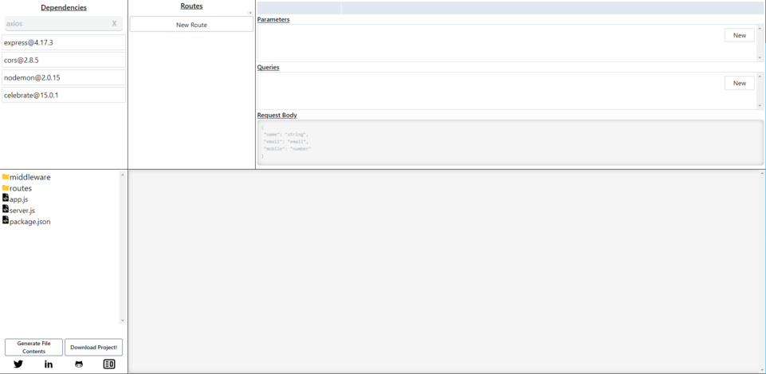

# API-Gen - Express Server Generator



A Simple React App that generates a boilerplate Express API Server using a simple form input style interface.

## Project Status
1 May 2022 v1.0.0 - First Release

## Requirement

- Node
- Npm

## Usage

Clone it!

```
$ git clone git@github.com:GeekStories/api-gen.git
```

Go into the project directory and run the command:

```
$ npm start
```

Open `http://localhost:3000` and enjoy!


## Contributors

- Creator of API-Gen @geekstories

## Tools Used
  - Core:
    - [React v18](https://reactjs.org/)
    - [React DOM](https://reactjs.org/docs/react-dom.html)
    - [React Icons](https://react-icons.github.io/react-icons/)
    - [React Scripts](https://www.npmjs.com/package/react-scripts)
  - Styling:
    - [TailwindCSS v3](https://tailwindcss.com/)
    - [Tailwind Styled Components](https://www.npmjs.com/package/tailwind-styled-components)
  - Extras:
    - [React Textarea Code Editor](https://www.npmjs.com/package/@uiw/react-textarea-code-editor)
    - [Js Beautify](https://www.npmjs.com/package/js-beautify)
    - [Js Zip](https://www.npmjs.com/package/jszip)
